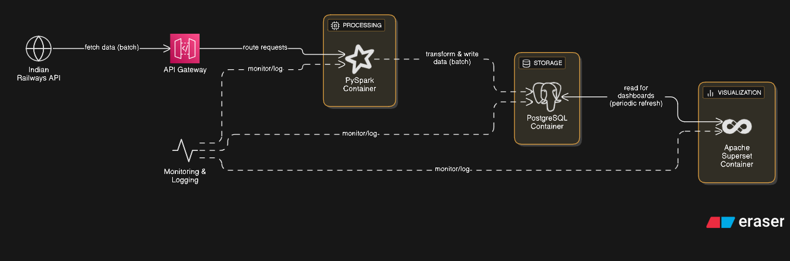

# 🚆 Train Express Tracker

**Train Express Tracker** is a containerized data engineering & visualization project that tracks real-time train movements in India using the **Indian Railways API**, processes and transforms the data with **PySpark**, stores it in **PostgreSQL**, and visualizes it using **Apache Superset** — all orchestrated via **Docker Compose**.

---

## 📜 Project Overview

This project automates the collection, transformation, and visualization of live train running status data:

1. **Data Ingestion** – Fetches live train data from the **Indian Railways API** inside a Dockerized service.
2. **Data Preprocessing & Transformation** – Uses **PySpark** for:
   - Cleaning & normalizing raw API data.
   - Handling missing values & inconsistent formats.
   - Creating analytics-ready datasets.
3. **Data Storage** – Stores processed data in a **PostgreSQL** database running in a Docker container.
4. **Visualization & Insights** – Connects **Apache Superset** (also in Docker) to PostgreSQL for:
   - Real-time dashboards.
   - Delay and route performance analysis.
   - Interactive geo-visualizations.

---

## 🏗 Architecture




### Key Components:

- Indian Railways API – Live train data source.

- PySpark (Docker) – ETL processing and transformations.

- PostgreSQL (Docker) – Data warehouse.

- Apache Superset (Docker) – Visualization platform.

- Docker Compose – Service orchestration.

## ⚙️ Tech Stack
| Component        | Technology Used        |
| ---------------- | ---------------------- |
| Language         | Python                 |
| Data Processing  | PySpark                |
| Database         | PostgreSQL             |
| Visualization    | Apache Superset        |
| API Source       | Indian Railways API    |
| Containerization | Docker, Docker Compose |

## 📂 Folder Structure
```plaintext
indian-train-live-tracker/
├── README.md
├── config
│   └── superset_config.py
├── data
├── db_backups
│   ├── ba
│   └── backup.sql
├── docker-compose.yml
├── hadoop
│   └── dfs
│       ├── data
│       └── name
├── hadoop-config
│   ├── core-site.xml
│   └── hdfs-site.xml
├── indian-railway-tracker
│   ├── __init__.py
│   └── utils
│       ├── __init__.py
│       ├── alter_tables.py
│       ├── create_tables.py
│       ├── fetch_schema.py
│       └── main.py
├── irctc-connect-main
│   ├── Dockerfile
│   ├── README.md
│   ├── controller
│   │   └── train.controller.js
│   ├── data
│   ├── index.d.ts
│   ├── routes
│   │   └── index.js
│   ├── server.js
│   └── utils
│       └── utils.js
├── kafka_data
│   ├── cleaner-offset-checkpoint
│   ├── log-start-offset-checkpoint
│   ├── meta.properties
│   ├── recovery-point-offset-checkpoint
│   └── replication-offset-checkpoint
├── notebooks
├── postgres_data
├── read_dir.py
├── utils
│   ├── __init__.py
│   └── helpers.py
```

## 🚀 Setup & Installation (Docker)
### 1️⃣ Clone the Repository
```bash
git clone https://github.com/yourusername/train-express-tracker.git
cd train-express-tracker

```
### 2️⃣ Create Environment Variables

Create a .env file:
```bash
RAILWAY_API_KEY=your_api_key_here
POSTGRES_USER=postgres
POSTGRES_PASSWORD=your_password
POSTGRES_DB=train_tracker
POSTGRES_PORT=5432
```
### 3️⃣ Start All Services
```bash
docker compose up -d --build
```

This will spin up:
- PySpark (for ETL jobs)
- PostgreSQL (for storage)
- Apache Superset (for dashboards)

### 4️⃣ Access Superset
- Open http://localhost:8088
- Connect Superset to the PostgreSQL container.
- Import superset_dashboards/dashboard_config.json for prebuilt dashboards.

## 🛠 Future Enhancements

- Add Apache Airflow container for automated scheduling.
- Integrate predictive delay analytics.
- Improve geo-mapping for better route visuals.